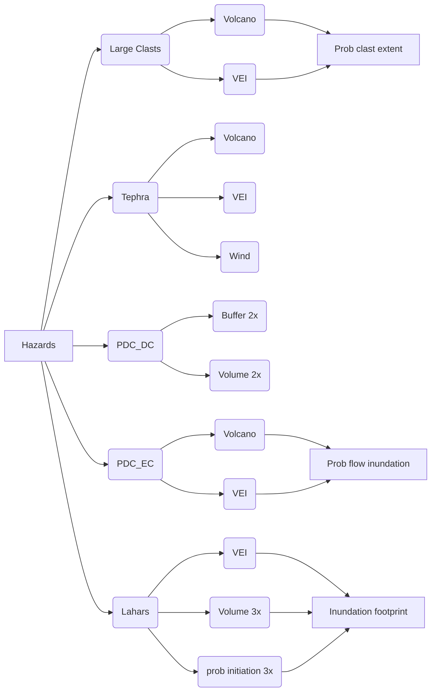

```mermaid
graph LR
    Hazards --> A1(Large Clasts);
        A1 --> A2(Volcano);
        A1 --> A3(VEI);

        A2 --> A4[Prob clast extent]
        A3 --> A4

    Hazards --> B1(Tephra);
        B1 --> B2(Volcano);
        B1 --> B3(VEI);
        B1 --> B4(Wind);

    Hazards --> C1(PDC_DC);
        C1 --> C2(Buffer 2x)
        C1 --> C3(Volume 2x)
        
    Hazards --> D1(PDC_EC);;
        D1 --> D2(Volcano);
        D1 --> D3(VEI);
        D2 --> D4[Prob flow inundation]
        D3 --> D4

    Hazards --> E1(Lahars);
        E1 --> E2(VEI)
        E1 --> E3(Volume 3x)
        E1 --> E4(prob initiation 3x)

        E2 --> E5[Inundation footprint]
        E3 --> E5[Inundation footprint]
        E4 --> E5[Inundation footprint]


```